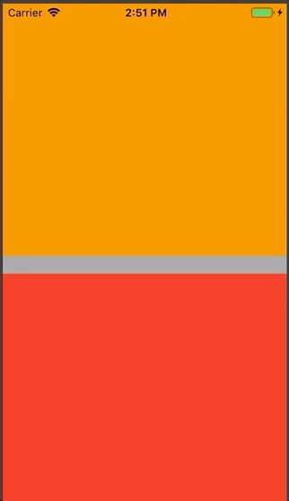

# SlideUpPanel



## How to use
### In AppDelegate
``` 
Replace the rootController with the SlideUpPanelController
```
``` swift
window.rootController = SlideUpPanelController(parent: ParentViewC(), content: ContentViewController())
```
``` 
That's it. For now :) More implementations still under work
```
